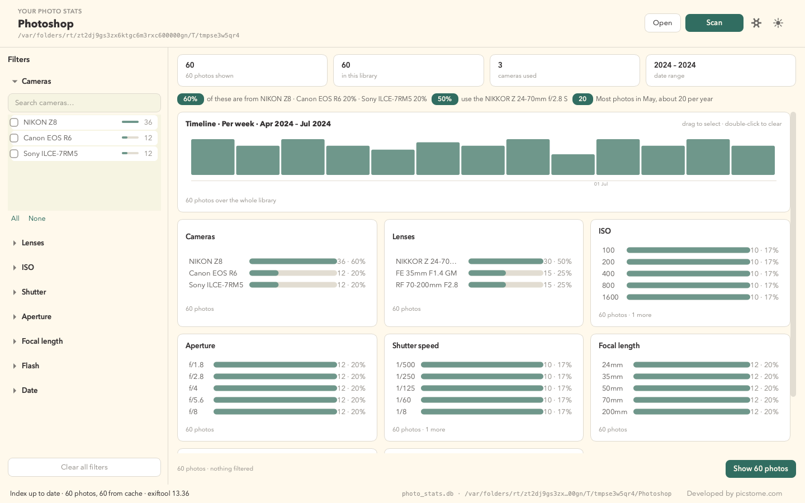

# Photo Stats

Photo Stats reads the EXIF metadata of a folder of photos and tells you what you
actually shoot: which camera and lens, which ISO, aperture, shutter speed and
focal length, over time. Filter by any of them and every chart updates together.

Everything runs on your machine. No account, no upload, no cloud.



---

## Install

Download the build for your platform from
[the releases page](https://github.com/picstome/photostats/releases).

| Platform | File |
|---|---|
| macOS (Apple silicon) | `Photo Stats-arm64.dmg` |
| macOS (Intel) | `Photo Stats-x64.dmg` |
| Windows | `PhotoStats-windows.zip`, or `PhotoStats-Setup.exe` for an installer |
| Linux | `PhotoStats-linux.tar.gz` |

The builds are **ad-hoc signed**, so the first launch warns:

- **macOS** — right-click the app → **Open** → **Open** once.
- **Windows** — SmartScreen → **More info** → **Run anyway**.

Both warnings disappear with a paid code-signing certificate.

### exiftool

Photo Stats reads metadata with [exiftool](https://exiftool.org), which has to be
installed once:

```bash
brew install exiftool                        # macOS
sudo apt install libimage-exiftool-perl      # Debian / Ubuntu
sudo dnf install perl-Image-ExifTool         # Fedora
```

On Windows, download `exiftool.exe` from exiftool.org and put it on your `PATH`.
If Photo Stats cannot find it, it shows a setup sheet with the right command, and
**Settings → exiftool → Locate…** can point at a specific file.

---

## Use it

1. **Open** a photo folder — the button, `Ctrl/Cmd+O`, or drag the folder onto the
   window.
2. The first scan writes `photo_stats.db` inside that folder and reads every
   photo. Later scans only read what is new or changed.
3. Click any bar to filter by it. Every chart updates together, and each shows
   what picking a different value would yield.

**The sidebar** starts with **Cameras** open and the rest collapsed. Rows show a
count and a share; the sliders span the values actually in your library; the date
fields rest on the oldest photo and on today. **Show N photos** opens the
matching files in their own window — sortable, with double-click to reveal in
Finder or Explorer.

**The scan is always visible.** Progress shows in the header, and a scan that
takes more than a moment also gets a dialog with a **Continue in background**
button, so it never blocks the window.

### RAW and JPEG of one shot count once

A camera writes a RAW and a JPEG for the same photograph; Photo Stats counts the
photograph. The RAW is kept (it carries the full EXIF) and the JPEG is discarded
before anything reads it, so nothing double-counts.

Precedence is **RAW → TIFF / HEIC → PNG / JPEG**; files group by folder and file
name (extension does not matter). A RAW in `raw/` and its JPEG in `jpeg/` count as
two — matching by name across folders would merge different shots.

### Languages

English and Spanish, in **Settings → Language**. With nothing chosen the app
follows the operating system.

The two catalogues are checked for gaps in the test suite. To list any untranslated
string yourself (from a checkout):

```bash
python -m photostats --audit-translations
```

It exits non-zero when something is missing, so an untranslated label cannot ship.

### Shortcuts

| | |
|---|---|
| `Ctrl/Cmd+O` | Open a folder |
| `Ctrl/Cmd+R` | Rescan |
| `Ctrl/Cmd+,` | Settings |
| `Ctrl/Cmd+Shift+L` | Toggle dark / light |
| `Esc` | Clear all filters |

---

## Command line

The whole engine is available without the window. With the project installed
(`pip install -e .`) the `photostats-cli` command is on your `PATH`; to run it
straight from a checkout without installing, use the module form.

```bash
# from a checkout
source .venv/bin/activate
photostats-cli ~/Pictures --stats

# or without activating anything
.venv/bin/python -m photostats.cli ~/Pictures --stats
```

```
Photo Stats
========================================
48,213 photos

=== Cameras ===
NIKON Z8: 21,404 (44.4%)
Canon EOS R6: 12,880 (26.7%)
…
```

Filters and exports:

```bash
photostats-cli ~/Pictures --camera "NIKON Z8" --iso-min 400 --iso-max 3200 --stats
photostats-cli ~/Pictures --csv photos.csv     # the matching photos, one row each
photostats-cli ~/Pictures --json report.json   # filters, full statistics, photos
photostats-cli ~/Pictures --no-scan            # use the cache only
photostats-cli ~/Pictures --reindex            # clear the cache and read everything
photostats-cli ~/Photos --import-legacy        # import an old cache and exit
```

Run `photostats-cli --help` for the full list, including `--from` / `--to`.

---

## Where the data lives

`photo_stats.db` is a plain SQLite file **inside your photo folder**, with paths
stored relative to it. That makes it portable — copy the folder to another
machine and the statistics come with it — and inspectable with any SQLite tool
(`sqlite3`, DB Browser, DuckDB, pandas). The schema is documented in
[docs/schema.md](docs/schema.md).

Read-only drives and network shares cannot hold the database (SQLite needs
locking), so the cache stays on your computer instead; **Settings → Statistics
cache** chooses where. Deleting `photo_stats.db` is always safe — the next scan
rebuilds it.

If you used the original `photo_stats.py`, Photo Stats offers to import its
`photo_stats_cache.db` the first time you open that folder.

---

## Settings

**Settings** covers the theme, the interface language, the cache location, the
exiftool path, and two indexing numbers. **Restore defaults** returns every field
to its shipped value.

The one setting that matters for speed is **Read files in parallel** — reading
EXIF parallelises almost perfectly. The default is `cores − 2`, capped at 12,
which keeps the machine responsive during a scan. **Batch size** is a distant
second: 50 is both the fastest and the smoothest.

---

## From source

```bash
git clone https://github.com/picstome/photostats.git
cd photostats
python3 -m venv .venv && source .venv/bin/activate
pip install -e ".[dev]"
python -m photostats                          # run the app
```

Run the tests and linter:

```bash
QT_QPA_PLATFORM=offscreen pytest -q
ruff check photostats tests
```

Build a distributable bundle (each platform builds on its own runner):

```bash
pyinstaller build/photostats.spec --noconfirm
```

### Building a release

Release builds come from `.github/workflows/build.yml`: tests run once, then
macOS arm64, macOS x64, Windows and Linux are built in parallel and attached to a
GitHub release. Push a `v*` tag to cut one:

```bash
git tag v1.0.0 && git push origin v1.0.0
```

To build one platform locally, run PyInstaller and then package it:

```bash
# macOS: sign, then build a drag-to-Applications DMG
APP="dist/Photo Stats.app"
codesign --deep --force --sign - "$APP"
STAGE="$(mktemp -d)" && cp -R "$APP" "$STAGE/" && ln -s /Applications "$STAGE/Applications"
hdiutil create -volname "Photo Stats" -srcfolder "$STAGE" -ov -format UDZO \
  "dist/Photo Stats-arm64.dmg"

# Windows (needs Inno Setup's iscc)
iscc /DMyAppVersion=1.0.0 build\photostats.iss   # writes dist\PhotoStats-Setup.exe
```

The macOS bundle identifier is **`com.picstome.photostats`**, set in
`build/photostats.spec`; a signing certificate has to match it.

---

## How it works

Architecture, the two-phase resumable scan, and the cross-filtering model are in
[docs/how-it-works.md](docs/how-it-works.md).

---

## License

MIT. Photo Stats reads metadata with [exiftool](https://exiftool.org), is built
with [PySide6](https://www.qt.io), and is packaged with
[PyInstaller](https://pyinstaller.org). The optional League Spartan typeface is
under the SIL Open Font License.
